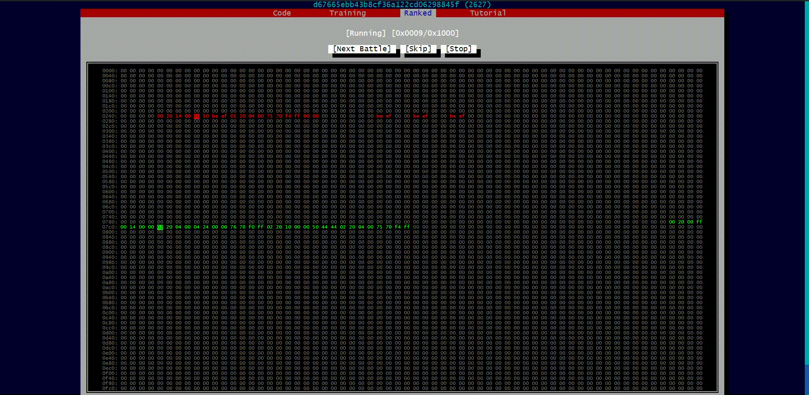

<h1 align="center">Assembly Arena </h1>

  

    A web-based assembly language programming game.
     
    <a href="https://www.assemblyarena.com"><strong>Play</strong></a>
     
     
    <a href="https://github.com/m2w4/assembly-arena/blob/main/docs/screenshots.md">Showcase</a>
    ·
    <a href="https://www.assemblyarena.com/#learn">Learn</a>
    ·
    <a href="https://github.com/m2w4/assembly-arena/blob/main/docs/vm-spec.md">Documentation</a>
  

## About
Assembly Arena is a programming game where participants create small assembly programs, to compete for control of a virtual computer's memory.

  

